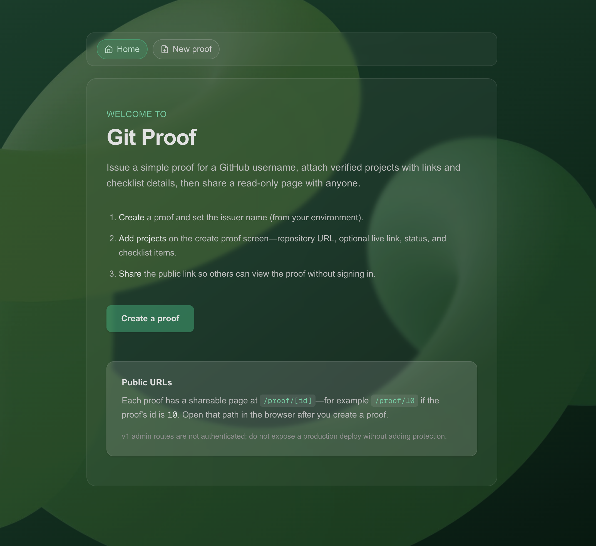
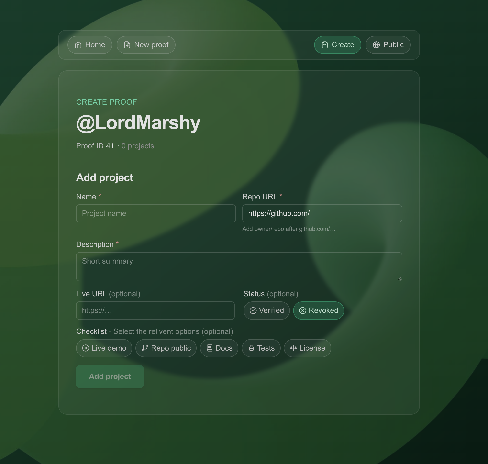
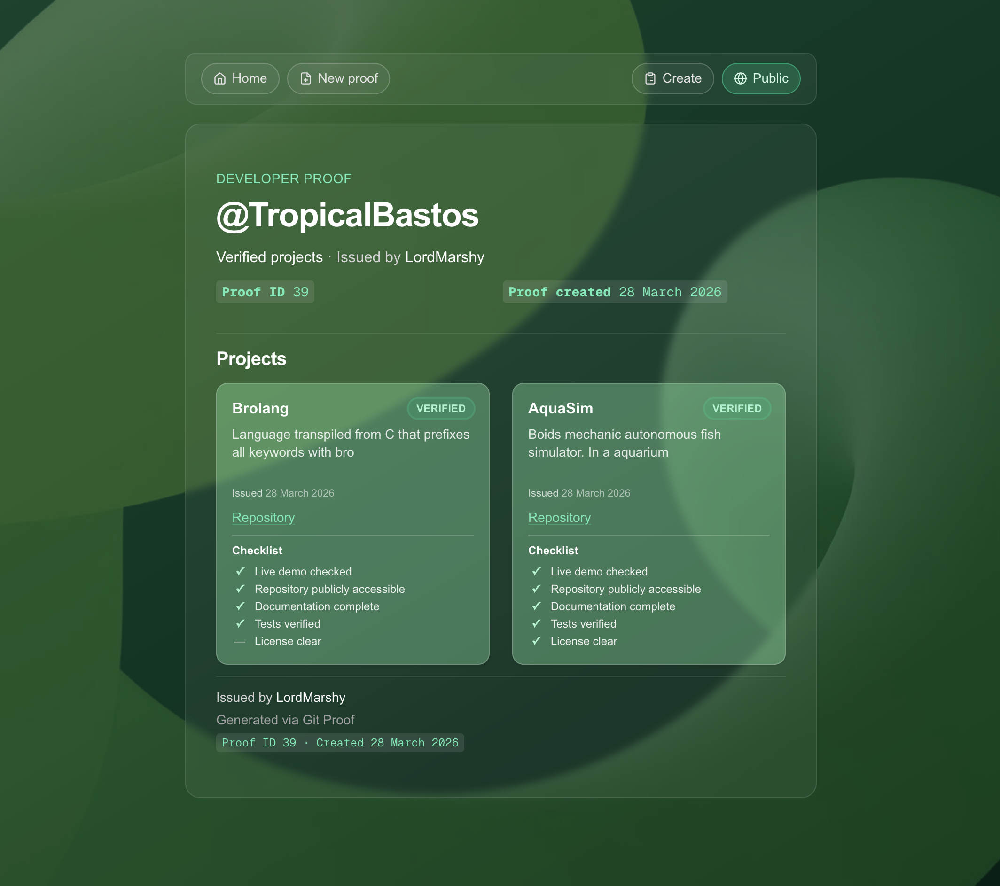
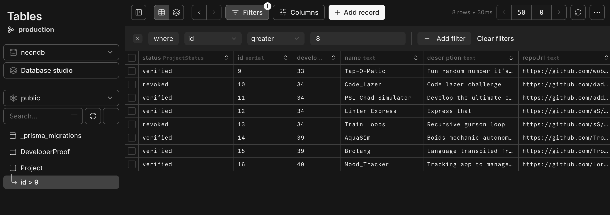

# Git Proof

**Git Proof** is a small web app for issuing and sharing **developer proofs**: you record a GitHub username, attach projects (repo URL, optional live link, status, and checklist flags), and share a **read-only public page** that lists those projects for anyone with the link.

Admin flows live under `/admin`; public views use `/proof/[id]`.

## Features

- **Create a proof** — Capture a GitHub username; the issuer name comes from your environment (`GIT_PROOF_ISSUER_NAME`).
- **Add projects** — For each proof: name, description, GitHub repo URL, optional live URL, **verified / revoked** status, and an optional **checklist** (live demo, repo public, documentation, tests, license).
- **Public proof page** — Read-only listing of projects with status badges, links, issued date, and checklist visibility (✓ / — per item).
- **Shared shell** — Centered content column, frosted panels, top nav with icons; nav splits **Home** + **New proof** on the left and **Create** (add projects for this proof) + **Public** on the right when a proof id is in context.

## Images

### Home (`/`)



### Create proof (`/admin/create`)



### Public proof (`/proof/[id]`)



### Neon database



## Stack

Git Proof is a **TypeScript** monolith-style app: the UI and API routes run in one **Next.js** process, data lives in **PostgreSQL** (this project is wired for **[Neon](https://neon.tech)**, a **serverless Postgres** platform), and tooling favours **Bun** end to end.

- **Next.js 16** — App Router, React Server Components where applicable, server actions for admin forms, `next/image` for optimised assets.
- **React 19** — Client components only where needed (e.g. interactive forms).
- **Tailwind CSS 4** — Utility-first styling; shared layout tokens live in `app/globals.css` (e.g. `layout-shell`, `panel-column`, frosted panels).
- **Prisma 7** — Schema-first access to Postgres; client generated to `app/generated/prisma` (see `prisma/schema.prisma`).
- **PostgreSQL via Neon** — [Neon](https://neon.tech) is a **serverless Postgres** host (scale-to-zero, branching, pooled connections). Prisma talks to it like any Postgres URL; the app uses `pg` with `@prisma/adapter-pg` as wired in the repo.
- **Bun** — Package install and scripts (`bun run dev`, `bun run build`, etc.); Prisma CLI via `bunx prisma`.
- **ESLint** — `eslint-config-next` for baseline lint rules.

## Routes

| Path | Purpose |
|------|---------|
| `/` | Home — overview and entry to create a proof |
| `/admin/create` | Create a new developer proof (GitHub username) |
| `/admin/proof/[id]` | Add and manage projects for proof `id` |
| `/proof/[id]` | Public, shareable view of proof `id` |

## Requirements

- [Bun](https://bun.sh)
- A PostgreSQL database — **[Neon](https://neon.tech)** (serverless Postgres) is the intended host; any Prisma-compatible Postgres URL works if you prefer another provider

## Setup

1. **Clone and install**

   ```bash
   git clone <your-repo-url>
   cd gitproof
   bun install
   ```

2. **Environment**

   ```bash
   cp .env.example .env
   ```

   - Set **`DATABASE_URL`** to your Postgres connection string. On **Neon**, use the **pooled** connection string from the dashboard (fits serverless / short-lived Next.js workloads).
   - Set **`GIT_PROOF_ISSUER_NAME`** to the name that should appear as the issuer on proofs (e.g. company or your name).

3. **Database**

   ```bash
   bunx prisma migrate dev --name init
   bunx prisma generate
   ```

   Optional: `bunx prisma studio` to inspect data.

4. **Run**

   ```bash
   bun run dev
   ```

   Open [http://localhost:3000](http://localhost:3000).

## Scripts

| Command | Description |
|---------|-------------|
| `bun run dev` | Next.js dev server |
| `bun run build` | Production build |
| `bun run start` | Start production server |
| `bun run lint` | ESLint |
| `bun run demo:dev` | Vite dev server for the browser-only demo in [`demo/`](demo/) |
| `bun run build:demo` | Build the demo into [`docs/`](docs/) for **GitHub Pages** |

## Static demo (GitHub Pages)

A **browser-only** copy of the UI lives in [`demo/`](demo/) (Vite + React + Tailwind). It uses **`localStorage`** instead of Postgres—useful for a public static preview.

- **Develop:** `bun run demo:dev` (opens the Vite app; routes use the hash, e.g. `#/admin/create`).
- **Publish:** run `bun run build:demo`, commit the generated files under **`docs/`**, then in the repo **Settings → Pages** set source to the **`/docs`** folder on your default branch.
- **Base path:** the demo build defaults to **`/gitproof/`** so assets work at `https://<user>.github.io/gitproof/`. For a different repo name, set `VITE_BASE` when building, e.g. `VITE_BASE=/my-repo/ bun run build:demo` from the `demo/` directory (see [`demo/vite.config.ts`](demo/vite.config.ts)).

Internal planning notes previously under `docs/` were moved to [`planning/`](planning/) so `docs/` can be overwritten by the demo build.

## Data model (summary)

- **DeveloperProof** — `githubUsername`, `issuerName`, timestamps; has many **Project** rows.
- **Project** — `name`, `description`, `repoUrl`, optional `liveUrl`, `status` (`verified` \| `revoked`), `issuedAt`, plus boolean checklist fields: `liveDemoChecked`, `repositoryPublic`, `documentationComplete`, `testsVerified`, `licenseClear`.

See `prisma/schema.prisma` for the source of truth.

## Security note (v1)

Routes under **`/admin` are not authenticated**. Anyone who can reach those URLs can create proofs and projects. **Do not** expose a production deployment to the public internet without adding auth (or network restrictions) if that matters for your use case.

## License

This project is licensed under the terms in **[LICENSE](./LICENSE)** (MIT-style permission with an **attribution requirement**).

You may use, modify, and distribute the code, but you **must give appropriate credit to Guy Marshman** as the original author of Git Proof (for example by keeping the copyright notice, linking this repository, or crediting in your README or product credits—see the LICENSE file for the full condition).

