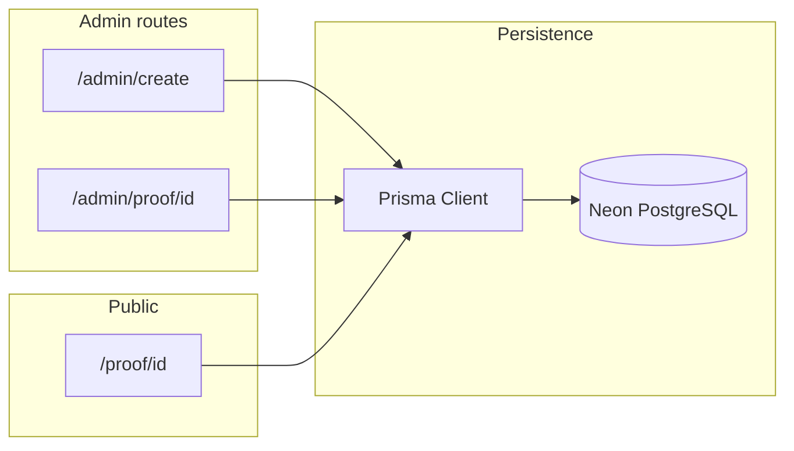

# Git Proof — Revised implementation plan (aligned to repo)

## Current state (verified)

[package.json](package.json) already defines **Next 16.2.1**, React 19, **Tailwind 4** (`@tailwindcss/postcss`), and scripts `next dev` / `next build` / `next start`. [bun.lock](bun.lock) is present. The tree is minimal: [app/layout.tsx](app/layout.tsx), [app/page.tsx](app/page.tsx), [app/globals.css](app/globals.css)—**no** `src/index.ts`, **no** `src/components/ui/` shadcn tree to port.

**Implication:** Drop the “replace bun-react-template / remove second runtime” narrative. Treat **scaffold as done**; focus on database, routes, and product UI. Before implementing unfamiliar APIs, follow [AGENTS.md](AGENTS.md): read the in-repo guide under `node_modules/next/dist/docs/` (this Next major differs from older docs).

## Target architecture

Same as your doc—unchanged:

## 1. Tooling and env (small deltas)

- Prefer **Bun** in docs and habit: `bun run dev`, `bun run build`, `bunx prisma generate`, `bunx prisma migrate dev` (optional: add explicit `postinstall` or README step for `prisma generate` after clone).
- Add `[.env.example](.env.example)` with `DATABASE_URL` (Neon pooled connection string) and `**GIT_PROOF_ISSUER_NAME`** (or your chosen name) for default `issuerName` on create.
- Update [README.md](README.md) to describe Git Proof, Bun commands, and Neon setup (minimal ops notes; avoid duplicating long Prisma tutorials).

## 2. Prisma + Neon

- Add `prisma` and `@prisma/client`; init `[prisma/schema.prisma](prisma/schema.prisma)` with `provider = "postgresql"`, `url = env("DATABASE_URL")`.
- **Models** (as you specified):
  - `DeveloperProof`: `id` (cuid or uuid), `githubUsername`, `issuerName`, `createdAt`.
  - `Project`: `id`, `developerProofId` + relation, `name`, `description`, `repoUrl`, optional `liveUrl`, `status` enum `verified | revoked`, `issuedAt`, **five booleans** for checklist items (name columns to match your brief’s labels; at least one maps to the “Live demo checked” rule on the public page).
- `@@index([developerProofId])` on `Project`.
- Run initial migration with `bunx prisma migrate dev`.

## 3. Data access

- Add e.g. `[lib/db.ts](lib/db.ts)`: Prisma client **singleton** with the standard Next dev guard (`globalThis`) to avoid connection churn on HMR.

## 4. Admin: create proof

- `[app/admin/create/page.tsx](app/admin/create/page.tsx)`: form collecting `githubUsername`; **Server Action** (dedicated `actions.ts` or colocated with `'use server'`) validates (trim, non-empty), creates `DeveloperProof` with `issuerName` from env (with sensible fallback only if you explicitly want one), then `redirect(\`/admin/proof/${id})`.

## 5. Admin: manage proof

- `[app/admin/proof/[id]/page.tsx](app/admin/proof/[id]/page.tsx)`: server component loads proof + `projects` (order by `issuedAt` desc).
- **Add project**: form + Server Action with all Project fields; set `issuedAt` to `new Date()` on create.
- **Optional DoD+**: toggle `verified` ↔ `revoked` per project (button + Server Action).

## 6. Public proof page

- `[app/proof/[id]/page.tsx](app/proof/[id]/page.tsx)`: load proof + projects; `notFound()` if missing.
- **Layout**: header (GitHub username, “Verified Projects”, issuer, proof id); cards (name, description, repo link, live link if present, status badge, issue date); checklist with **human labels**; **hide “Live demo checked” (or equivalent) row unless the boolean is true**; footer (issued by, “Generated via Git Proof”, proof id, created date).
- Semantic HTML, focus-visible friendly links, accessible status text (not color-only).

## 7. Styling / UI

- There is **nothing to port** from an old template. Choose one:
  - **Minimal**: build cards/forms with Tailwind + native elements in `app/` (fastest).
  - **shadcn/Radix**: run the project’s supported shadcn init for App Router and add Button, Card, Input, Label, Select, Textarea as needed—keep a single design system.
- Replace default [app/page.tsx](app/page.tsx) with a short landing: links to `/admin/create` and maybe a sample `/proof/[id]` note.
- Tweak [app/layout.tsx](app/layout.tsx) metadata (title/description) for “Git Proof”.

## 8. Security (v1)

- State explicitly in README: **no auth**; `/admin/`* is world-writable by URL. Optional later: middleware + secret—not in v1 scope.

## 9. Definition of Done (unchanged)

- Create proof → redirect to manage; add multiple projects; persistence in Neon; public page shows projects, checklist visibility rule, status badges; `bun run dev` works; Prisma via `bunx`.

## Todo mapping vs your list

| Your id                                          | Adjustment                                                                                                                 |
| ------------------------------------------------ | -------------------------------------------------------------------------------------------------------------------------- |
| `scaffold-next`                                  | **Mostly complete**—optional: landing page, metadata, README/Bun wording, remove create-next-app boilerplate copy on home. |
| `prisma-neon`                                    | Unchanged.                                                                                                                 |
| `admin-create` / `admin-manage` / `public-proof` | Unchanged.                                                                                                                 |
| `ui-port`                                        | Rename intent: **add UI** (shadcn fresh or minimal Tailwind)—not “port from old repo”.                                     |

