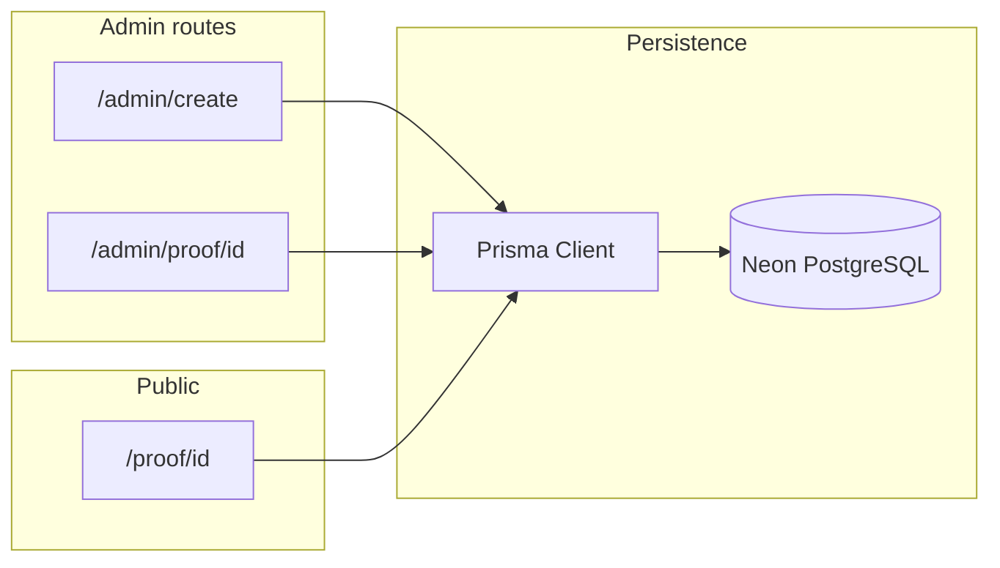

# Git Proof — Revised implementation plan (aligned to repo)

## Current state (verified)

[package.json](package.json) already defines **Next 16.2.1**, React 19, **Tailwind 4** (`@tailwindcss/postcss`), and scripts `next dev` / `next build` / `next start`. [bun.lock](bun.lock) is present. The tree is minimal: [app/layout.tsx](app/layout.tsx), [app/page.tsx](app/page.tsx), [app/globals.css](app/globals.css)—**no** `src/index.ts`, **no** `src/components/ui/` shadcn tree to port.

**Implication:** Drop the “replace bun-react-template / remove second runtime” narrative. Treat **scaffold as done**; focus on database, routes, and product UI. Before implementing unfamiliar APIs, follow [AGENTS.md](AGENTS.md): read the in-repo guide under `node_modules/next/dist/docs/` (this Next major differs from older docs).

## Target architecture

Same as your doc—unchanged:

## 1. Tooling and env (small deltas)

- Prefer **Bun** in docs and habit: `bun run dev`, `bun run build`, `bunx prisma generate`, `bunx prisma migrate dev` (optional: add explicit `postinstall` or README step for `prisma generate` after clone).
- Add [`.env.example`](.env.example) with `DATABASE_URL` (Neon pooled connection string) and **`GIT_PROOF_ISSUER_NAME`** (or your chosen name) for default `issuerName` on create.
- Update [README.md](README.md) to describe Git Proof, Bun commands, and Neon setup (minimal ops notes; avoid duplicating long Prisma tutorials).

## 2. Prisma + Neon

- Add `prisma` and `@prisma/client`; init [`prisma/schema.prisma`](prisma/schema.prisma) with `provider = "postgresql"`, `url = env("DATABASE_URL")`.
- **Models** (as you specified):
  - `DeveloperProof`: `id` (cuid or uuid), `githubUsername`, `issuerName`, `createdAt`.
  - `Project`: `id`, `developerProofId` + relation, `name`, `description`, `repoUrl`, optional `liveUrl`, `status` enum `verified | revoked`, `issuedAt`, **five booleans** for checklist items (name columns to match your brief’s labels; a